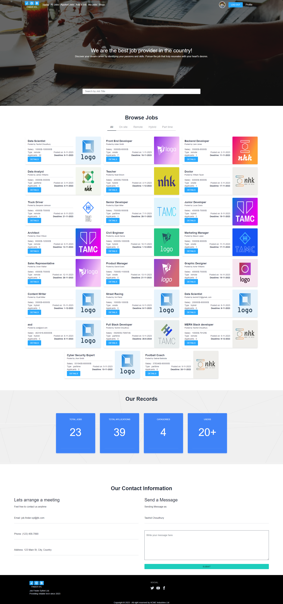
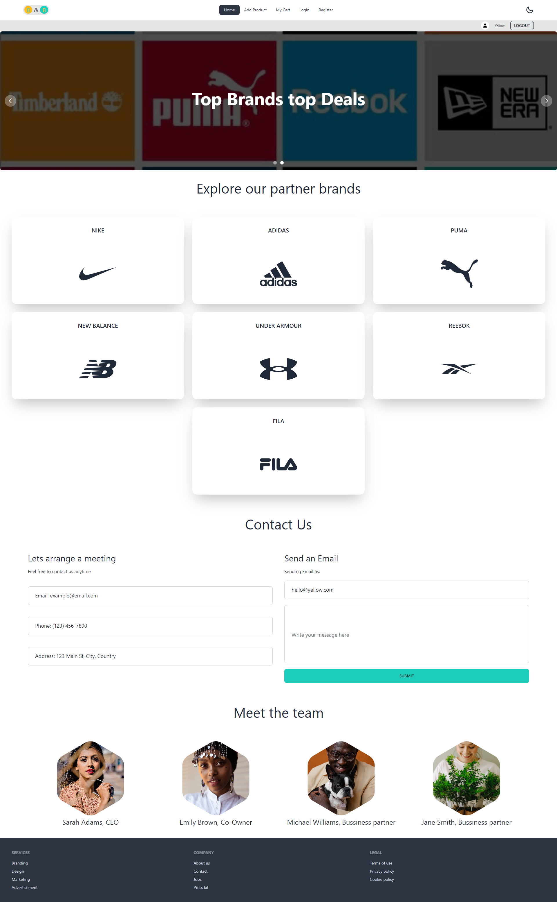

.png> "Tawhid Cover image")

## WELCOME! Hope you are having a wonderful day! 👋

Hello! I'm Tawhid, a recent Computer Science and Technology graduate from BRAC University, Bangladesh. 🎓 Eager to forge my path in the digital realm, I've set my sights on becoming a skilled web developer.

Embarking on a journey into the world of React and the MERN Stack, I'm dedicated to mastering the intricacies of web development. From front-end enchantment with React to delving into the depths of MongoDB, Express.js, and Node.js, I'm on a mission to craft robust and dynamic web solutions.

Equipped with a solid academic foundation and a hunger for knowledge, I'm enthusiastic about embracing challenges and staying on the cutting edge of technology. My passion for coding is fueled by the belief that great software can change the world.

 

## My overview:

- 🙂 Technologies I’m good at : React, Tailwind, MUI, React Router, NodeJS, Firebase, ExpressJS and more
- 🌱 I’m currently learning : Framer Motion, Mongoose
- 🤔 I’m trying - To become a web developer.
- 🔭 I’m currently - A fresh graduate looking for jobs.

 

## Technologies that I know:

  

 

## Pinned projects description:

### HOMEHIVE - Real Estate Marketplace

  

[LiveLink](https://homehive-84c83.web.app/) &nbsp;&nbsp;&nbsp; [Front-end Repo](https://github.com/tawhid-choudhury/home-hive-Real-estate-website-client) &nbsp;&nbsp;&nbsp; [Back-end Repo](https://github.com/tawhid-choudhury/home-hive-Real-estate-website-server)

**Technologies Used:**

- Vite
- React
- React-router-dom
- Material UI
- Tailwind CSS
- Framer Motion
- NodeJs
- ExpressJs
- JWT
- Stripe

**Project Description:**

- Crafted a responsive React.js interface for HomeHive, enhancing user experience across devices.
- Implemented a versatile dashboard system catering to various user types.
- Leveraged Framer Motion for captivating animations on the home page.
- Ensured user authenticity using JWT cookies for secure authentication.
- Employed React Router DOM to create a seamless single-page web application.
- Integrated Stripe API, offering users a frictionless and secure payment system.

Explore the LiveLink and repositories to witness the synergy of cutting-edge technologies in revolutionizing the real estate experience with HomeHive! 🏡✨

 

### JOBFINDERSYL - An Online Job Hunting Platform

  

[LiveLink](https://jobfindersyl.web.app) &nbsp;&nbsp;&nbsp; [Front-end Repo](https://github.com/tawhid-choudhury/job-finder-client) &nbsp;&nbsp;&nbsp; [Back-end Repo](https://github.com/tawhid-choudhury/job-finder-server)

**Technologies Used:**

- Vite
- React
- React-router-dom
- Daisy UI
- Tailwind CSS
- NodeJs
- ExpressJs
- JWT

**Project Description:**

- Developed an innovative online job hunting platform using Vite and React.
- Utilized React-router-dom for smooth navigation and a user-friendly experience.
- Employed Daisy UI and Tailwind CSS for a sleek and responsive design.
- Built a robust back-end with NodeJs and ExpressJs to handle job data and user interactions.
- Ensured secure user authentication through JWT for a seamless login experience.

Explore the LiveLink and repositories to dive into the world of job opportunities with JOBFINDERSYL! 🌐🔍

 

### JOBFINDERSYL - An Online Job Hunting Platform

  

[LiveLink](https://branddealsa10.web.app/) &nbsp;&nbsp;&nbsp; [Front-end Repo](https://github.com/tawhid-choudhury/brand-deals-client) &nbsp;&nbsp;&nbsp; [Back-end Repo](https://github.com/tawhid-choudhury/brand-deals-server)

**Technologies Used:**

- Vite
- React
- React-router-dom
- Daisy UI
- Tailwind CSS
- NodeJs
- ExpressJs

**Project Description:**

- Developed an innovative online job hunting platform using Vite and React.
- Utilized React-router-dom for smooth navigation and a user-friendly experience.
- Employed Daisy UI and Tailwind CSS for a sleek and responsive design.
- Built a robust back-end with NodeJs and ExpressJs to handle job data and user interactions.

## Reach me out:

&nbsp;&nbsp;&nbsp;&nbsp;&nbsp;&nbsp;&nbsp;&nbsp;&nbsp;&nbsp;&nbsp;&nbsp;

 

## Check out my stats:

 
 

